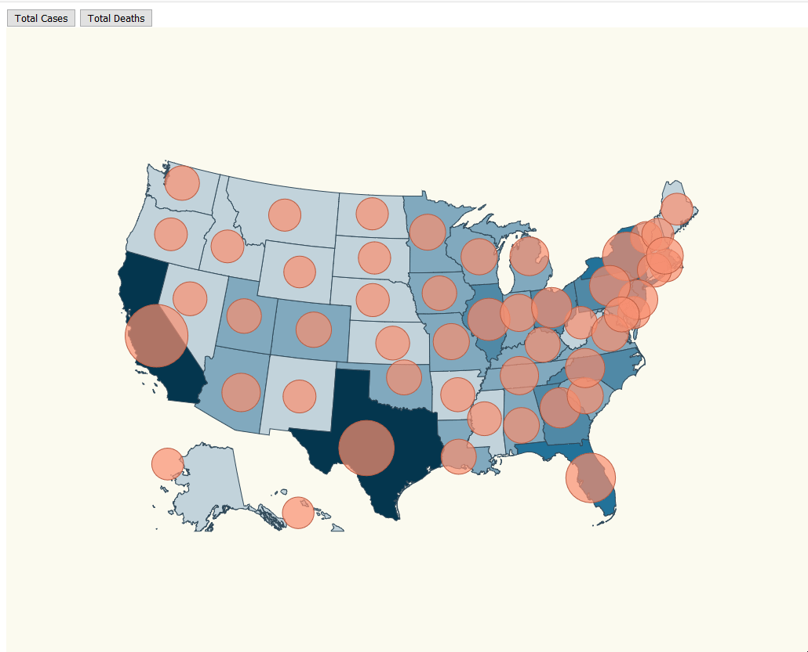

# Map of COVID cases in Spain (version 2.0)



This time, we will add a new feature to the version 1.0 of the Map: https://github.com/casaar97/D3JS-SpainCovidMap-V1

We have to face two challenges here:

- Set a color scale for the number of cases.
- Set a color for each community depending of it's number of cases using the color scale.

# Steps

Although the version 1.0 of the map is very similar, I will explain everything from the scratch just to make sure that you understand everything.

The first thing you have to do is to create a project folder containing the following files and directories:

- src/ (directory)
- package.json (npm configuration file)
- tsconfig.json (typescript configuration file)

The second thing we need to do is to install npm and the following modules:

```bash
npm install
```

When you deal with maps you can use two map formats GeoJSON or TopoJSON, topoJSON is lightweight and offers some extra features, let's install the needed package to work with:

```bash
npm install topojson-client --save
```

```bash
npm install @types/topojson-client --save-dev
```

Let's install the library that contains this projections:

```bash
npm install d3-composite-projections --save
```

Let's install the node typings to get require typing:

```bash
npm install @types/node --save-dev
```

Once we have everything we needed installed, let´s create the required files in the src/ directory:

- src/index.ts: Business logic.
- src/communities.ts: Contains information about the latitude and longitude of each community of Spain.
- src/stats.ts: Contains information about COVID-19 cases per community.
- src/index.html: HTML code of the project.
- src/map.css: CSS code of the project.

### src/index.html:

```diff
<html>
  <head>
    <link rel="stylesheet" type="text/css" href="./map.css" />
    <link rel="stylesheet" type="text/css" href="./base.css" />
  </head>
  <body>
    <div>
      <button id="initial">Show initial stats</button>
      <button id="final">Show final stats</button>
    </div>
    <script src="./index.ts"></script>
  </body>
</html>
```

### src/communities.ts:

```typescript
export const latLongCommunities = [
  {
    name: "Madrid",
    long: -3.70256,
    lat: 40.4165,
  },
  {
    name: "Andalucía",
    long: -4.5,
    lat: 37.6,
  },
  {
    name: "Valencia",
    long: -0.37739,
    lat: 39.45975,
  },
  {
    name: "Murcia",
    long: -1.13004,
    lat: 37.98704,
  },
  {
    name: "Extremadura",
    long: -6.16667,
    lat: 39.16667,
  },
  {
    name: "Cataluña",
    long: 1.86768,
    lat: 41.82046,
  },
  {
    name: "País Vasco",
    long: -2.75,
    lat: 43.0,
  },
  {
    name: "Cantabria",
    long: -4.03333,
    lat: 43.2,
  },
  {
    name: "Asturias",
    long: -5.86112,
    lat: 43.36662,
  },
  {
    name: "Galicia",
    long: -7.86621,
    lat: 42.75508,
  },
  {
    name: "Aragón",
    long: -1.0,
    lat: 41.0,
  },
  {
    name: "Castilla y León",
    long: -4.45,
    lat: 41.383333,
  },
  {
    name: "Castilla La Mancha",
    long: -3.000033,
    lat: 39.500011,
  },
  {
    name: "Islas Canarias",
    long: -15.5,
    lat: 28.0,
  },
  {
    name: "Islas Baleares",
    long: 2.52136,
    lat: 39.18969,
  },
  {
    name: "Navarra",
    long: -1.65,
    lat: 42.816666,
  },
  {
    name: "La Rioja",
    long: -2.445556,
    lat: 42.465,
  },
  {
    name: "Ceuta",
    long: -5.3162,
    lat: 35.8883,
  },
  {
    name: "Melilla",
    long: -2.93848,
    lat: 35.2919,
  },
];
```

### src/stats.ts:

```typescript
export interface ResultEntry {
  name: string;
  value: number;
}

export const initialStats: ResultEntry[] = [
  {
    name: "Madrid",
    value: 174,
  },
  {
    name: "La Rioja",
    value: 39,
  },
  {
    name: "Andalucía",
    value: 34,
  },
  {
    name: "Cataluña",
    value: 24,
  },
  {
    name: "Valencia",
    value: 30,
  },
  {
    name: "Murcia",
    value: 0,
  },
  {
    name: "Extremadura",
    value: 6,
  },
  {
    name: "Castilla La Mancha",
    value: 16,
  },
  {
    name: "País Vasco",
    value: 45,
  },
  {
    name: "Cantabria",
    value: 10,
  },
  {
    name: "Asturias",
    value: 5,
  },
  {
    name: "Galicia",
    value: 3,
  },
  {
    name: "Aragón",
    value: 11,
  },
  {
    name: "Castilla y León",
    value: 19,
  },
  {
    name: "Islas Canarias",
    value: 18,
  },
  {
    name: "Islas Baleares",
    value: 6,
  },
  {
    name: "Navarra",
    value: 20,
  },
  {
    name: "Ceuta",
    value: 5,
  },
  {
    name: "Melilla",
    value: 25,
  },
];

/*
Data taken from 
https://www.eldiario.es/sociedad/mapa-datos-coronavirus-espana-comunidades-autonomas-abril-9_1_1039633.html
"casos notificados en el dia"
14/04/2021
*/

export const finalStats: ResultEntry[] = [
  {
    name: "Madrid",
    value: 646763,
  },
  {
    name: "La Rioja",
    value: 28525,
  },
  {
    name: "Andalucía",
    value: 523865,
  },
  {
    name: "Cataluña",
    value: 553393,
  },
  {
    name: "Valencia",
    value: 387611,
  },
  {
    name: "Murcia",
    value: 109529,
  },
  {
    name: "Extremadura",
    value: 72442,
  },
  {
    name: "Castilla La Mancha",
    value: 179346,
  },
  {
    name: "País Vasco",
    value: 171232,
  },
  {
    name: "Cantabria",
    value: 26990,
  },
  {
    name: "Asturias",
    value: 48771,
  },
  {
    name: "Galicia",
    value: 118559,
  },
  {
    name: "Aragón",
    value: 113630,
  },
  {
    name: "Castilla y León",
    value: 217129,
  },
  {
    name: "Islas Canarias",
    value: 49630,
  },
  {
    name: "Islas Baleares",
    value: 58380,
  },
  {
    name: "Navarra",
    value: 56959,
  },
  {
    name: "Ceuta",
    value: 5515,
  },
  {
    name: "Melilla",
    value: 8279,
  },
];
```

### src/map.css:

We will create two classes:

- country: Class for the country color and community lines.
- affected-marker: Class for the orange circles.

```typescript
.country {
  stroke-width: 1;
  stroke: #c3d3db;
  fill: #008c86;
}

.affected-marker {
  stroke-width: 1;
  stroke: #bc5b40;
  fill: #f88f70;
  fill-opacity: 0.7;
}
```

We will use Spain topojson info: https://github.com/deldersveld/topojson/blob/master/countries/spain/spain-comunidad-with-canary-islands.json

Let's copy it under the following route _./src/spain.json_

- Now we will import all the required dependencies into _index.ts_:

_./src/index.ts_

```diff
import * as d3 from "d3";
import * as topojson from "topojson-client";
const spainjson = require("./spain.json");
const d3Composite = require("d3-composite-projections");
import { latLongCommunities } from "./communities";
import { initialStats, finalStats, ResultEntry } from "./stats";
```

- Let's build the Spain map:

_./src/index.ts_

```typescript
const aProjection = d3Composite
  .geoConicConformalSpain() // Let's make the map bigger to fit in our resolution
  .scale(3300)
  // Let's center the map
  .translate([500, 400]);

const geoPath = d3.geoPath().projection(aProjection);
const geojson = topojson.feature(spainjson, spainjson.objects.ESP_adm1);
);
```

Now let's create the map:

```typescript
const svg = d3
  .select("body")
  .append("svg")
  .attr("width", 1024)
  .attr("height", 800)
  .attr("style", "background-color: #FBFAF0");

svg
  .selectAll("path")
  .data(geojson["features"])
  .enter()
  .append("path")
  .attr("class", "country")
  // data loaded from json file
  .attr("d", geoPath as any);
```

At this point, the map has been created. Now we will create some functions in order to make everything work as we desire:

### Get the number of cases of the most affected community:

```typescript
const calculateMaxAffected = (dataset: ResultEntry[]) => {
  return dataset.reduce(
    (max, item) => (item.value > max ? item.value : max),
    0
  );
};
```

### Create a radius scale for the radius of each community circunference depending on the number of cases of the most affected community:

```typescript
const calculateAffectedRadiusScale = (maxAffected: number) => {
  return d3.scaleLinear().domain([0, maxAffected]).range([0, 50]);
};
```

### Scale the radius of each circunference depending on the number of cases:

```typescript
const calculateRadiusBasedOnAffectedCases = (
  comunidad: string,
  dataset: ResultEntry[]
) => {
  const maxAffected = calculateMaxAffected(dataset);

  const affectedRadiusScale = calculateAffectedRadiusScale(maxAffected);

  const entry = dataset.find((item) => item.name === comunidad);

  return entry ? affectedRadiusScale(entry.value) + 5 : 0;
};
```

### Create a color scale in order to assign a color for each community depending on it's COVID-19 number of cases:

```typescript
const getScaledColor = (dataset: ResultEntry[]) => {
  const maxValue = calculateMaxAffected(dataset);

  const color = d3
    .scaleThreshold<number, string>()
    .domain([
      0,
      maxValue * 0.1,
      maxValue * 0.25,
      maxValue * 0.5,
      maxValue * 0.75,
      maxValue,
    ])
    .range(["#fcfeff", "#c3d3db", "#80a9bd", "#5089a6", "#227199", "#04364f"]);

  return color;
};
```

### Assing a color to each community depending on it's COVID-19 number of cases:

```typescript
const assignColorToCommunity = (comunidad: string, dataset: ResultEntry[]) => {
  const entry = dataset.find((item) => item.name === comunidad);

  const color = getScaledColor(dataset);

  return entry ? color(entry.value) : color(0);
};
```

### Update chart when buttons are clicked

We now that we have to pass d.properties.NAME_1 as a parameter for assignColorToCommunity function because when we inspect spain.json, we can see that the property NAME_1 refers to the community name.

```typescript
const updateChart = (dataset: ResultEntry[]) => {
  svg.selectAll("path").remove();

  svg
    .selectAll("path")
    .data(geojson["features"])
    .enter()
    .append("path")
    .attr("class", "country")
    // data loaded from json file
    .attr("d", geoPath as any)
    .style("fill", function (d: any) {
      return assignColorToCommunity(d.properties.NAME_1, dataset);
    });

  svg.selectAll("circle").remove();

  svg
    .selectAll("circle")
    .data(latLongCommunities)
    .enter()
    .append("circle")
    .attr("class", "affected-marker")
    .attr("r", (d) => calculateRadiusBasedOnAffectedCases(d.name, dataset))
    .attr("cx", (d) => aProjection([d.long, d.lat])[0])
    .attr("cy", (d) => aProjection([d.long, d.lat])[1]);
};
```

### Add button logic

```typescript
document
  .getElementById("initial")
  .addEventListener("click", function handleInitialStats() {
    updateChart(initialStats);
  });

document
  .getElementById("final")
  .addEventListener("click", function handleFinalStats() {
    updateChart(finalStats);
  });
```
